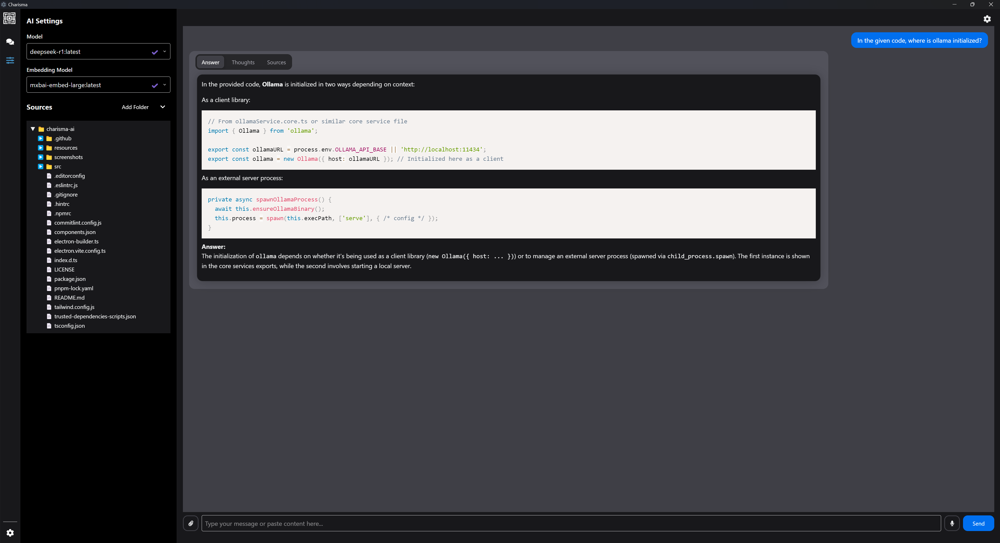

# 🌟 Charisma Studio 🌟

**Ask questions about your local folders using local LLMs with RAG-powered insights.**

Charisma Studio is a desktop client that transforms how you interact with local directories (codebases, research papers, projects) and web sources by combining LLMs like Ollama with Retrieval-Augmented Generation (RAG) and a vector database search. Select any folder, and/or any sources from the web and get AI-powered context about its contents through an intuitive chat interface.

---

## 🖼️ Screenshots

- Charisma explaining it's own code, where ollama is initialised.
--

## 🚀 Features

### Core Capabilities

- **Local LLM Integration** - Direct connection to Ollama instances
- **RAG-Powered Insights** - Database vector search for precise context
- **Multi-Format Support** - Process code, text, Markdown, and PDFs
- **Real-Time Streaming** - Typewriter-style response delivery

### Developer Experience

- **Electron Packaging** - Cross-platform desktop app
- **TypeSafe Architecture** - Built with React + TypeScript

---

## 🛠 Technology Stack

| Component | Choice | Why? |
| :-- | :-- | :-- |
| **Frontend** | React + TypeScript |
| **Styling** | Tailwind CSS + Headless UI |
| **LLM Core** | Ollama + HNSWLib | LangChain | Local-first, privacy focused |
| **Packaging** | Electron + Vite | Cross-platform binaries |


---

## ⚙️ Installation

### Prerequisites Checklist

- [ ] Node.js 18+ ([download](https://nodejs.org/))

Binaries placed them into their respective folder in: resources/win/bin/
- [ ] Piper ([Link](https://github.com/rhasspy/piper/releases)) 
- [ ] Ollama ([Link](https://github.com/ollama/ollama/releases)) 

```bash
# 1. Clone repository
git clone https://github.com/ollama/ollama.git
cd charisma-ai

# 2. Install dependencies
pnpm install

# 3. Download the piper and ollama binaries and place them into their respective folder in: resources/win/bin/ 


# 4. Start dev server
pnpm dev
```

## 📦 Distribution

### For all platforms

**Note**: Check [Electron Builder docs](https://www.electron.build/cli) for more knowledge

```bash
pnpm build
```

### For a specific one

```bash
pnpm build --mac
# OR
pnpm build --win
# OR
pnpm build --linux
```

The built apps will be available on the `release` folder.

## 🛣 Roadmap

### Updates

- [x] Multiple conversations with storage
- [x] TTS
- [x] Improved RAG data sources
- [x] AI response sources
- [x] Web RAG queries
- [x] Switch to hnswlib from ChromaDB (licensing and more flexible)
- [ ] Web RAG query pdf/file download support
- [ ] Next prompt suggestions
- [ ] Reasoning model "thinking" support
- [ ] Automatically download ollama and dependencies
- [ ] Ability to add custom models
- [ ] Relational database queries
- [ ] Translate results
- [ ] LlamaIndex full integration
- [ ] JSON "Tools/Agents"
- [ ] Settings
- [ ] Dark theme
- [ ] Ignore Paths, Files, Source Settings
- [ ] Coding mode setting
- [ ] TTS voice model selection
- [ ] Source viewing/editing along with the ability to read using TTS
- [ ] CSV file support
- [ ] Improved handling of Ollama being installed and exe files not present in release.
- [ ] Agents/Pipelines/Custom Reasoning
- [ ] Agent tasks such as creating, editing, writing files

### Future Vision

- **Easy access to run any AI locally** 
- **AI Pair Programmer** - Refactor code via chat
- **Multi Source Data Analysis** - Images/PDFs/Web Sources/Database support
- **AI Collaboration** - Shared session histories

---

## 🤝 Contributing

We welcome contributions! Please follow our [contribution guidelines](CONTRIBUTING.md) and:

1. Fork the repository
2. Create feature branch (`git checkout -b feat/amazing-feature`)
3. Commit changes (`git commit -m 'Add amazing feature'`)
4. Push branch (`git push origin feat/amazing-feature`)
5. Open Pull Request

---

## 📜 License

*Ollama (MIT), Piper (MIT) and hnswlib/hnswlib-node (Apache) have their own licenses - please review separately.
